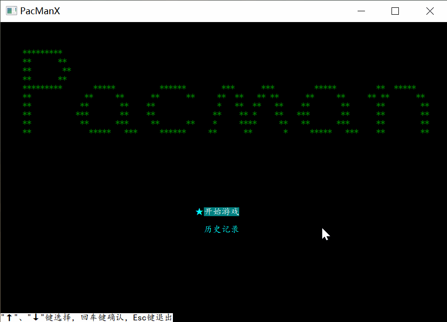
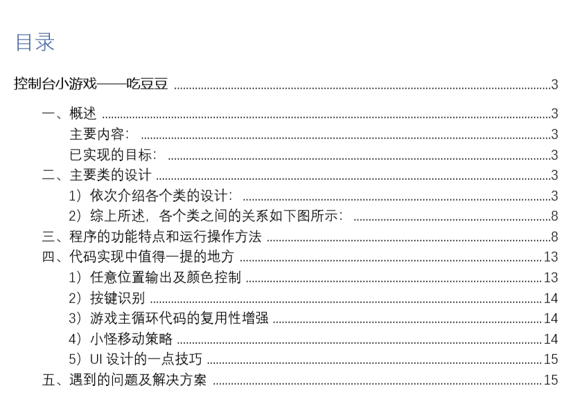

# PacManX
*——南京大学2019秋季学期 ”高级程序设计 “ 课程设计一*

基于C++控制台（Windows平台）的一个吃豆人小游戏  

**已实现的目标：**

- 地图支持自定义编辑（可编辑地图中的：空地、墙、豆子、超级豆子、小怪初始位置及数量、吃豆人初始位置）
- 可选择游戏难度（即设定不同的小怪移动速度）
- 怪兽可追踪吃豆人位置，往吃豆人的所在位置靠近
- 有用户友好的UI界面（比如：吃到超级豆子后吃豆人变彩色闪烁，且下方显示进度条倒计时；选择界面高亮显示选项）
- **可查看历史记录TOP 10，并且可对游戏记录进行回放**
- **在回放的过程中，支持按下方向键后，退出回放模式，在当前情形下，操纵吃豆人，进入正常的游戏模式，继续游戏**

**可执行程序下载地址：**

https://github.com/NJU-TJL/PacManX/releases
  
****
  
**Copyright © 2020 NJU-TJL**  

**[开放源代码许可](https://github.com/NJU-TJL/PacManX/blob/master/LICENSE)**

**转载请注明原作者：https://github.com/NJU-TJL/PacManX**
  
****

详情请见于：[课程设计报告](https://github.com/NJU-TJL/PacManX/blob/master/Docs/%E8%AF%BE%E7%A8%8B%E8%AE%BE%E8%AE%A1%E6%8A%A5%E5%91%8A%20-%20%E5%90%83%E8%B1%86%E4%BA%BA%20PacManX.pdf)  

  

